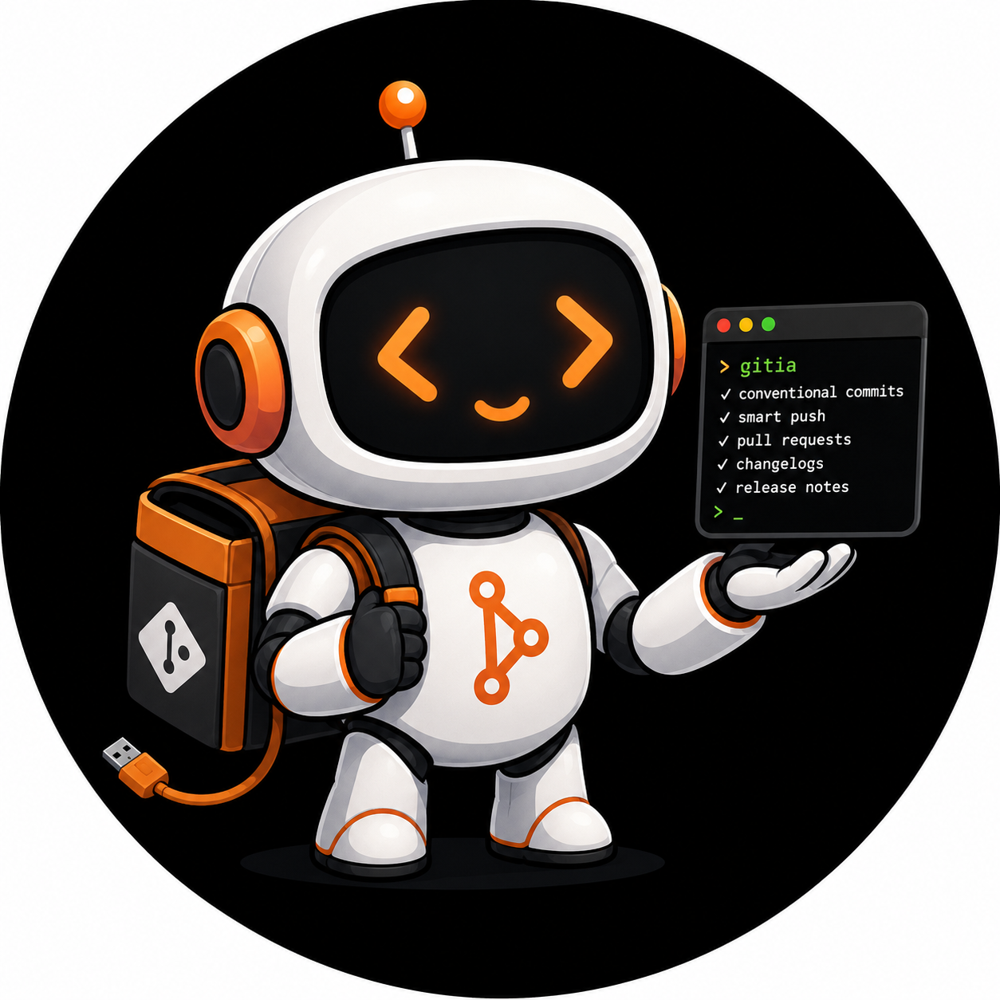

<p align="center">
  
</p>

# openbench (`ob`)

Go CLI to orchestrate **local dev environments** (Docker Compose), generate **Conventional Commits** with affordable AI, automate **push**, and create detailed **Pull Requests** via GitHub CLI.

---

## Table of contents

- [Why openbench?](#why-openbench)
- [Requirements](#requirements)
- [Quick install](#quick-install)
- [TUI dashboard](#command-reference)
- [Manual install](#manual-install)
- [Updating](#updating)
- [Configuration](#configuration)
- [Versioning](#versioning)
- [Command reference](#command-reference)
- [Global and per-command flags](#global-and-per-command-flags)
- [Detailed usage](#detailed-usage)
- [Repository health (`ob doctor`)](#repository-health-ob-doctor)
- [Token usage and cost](#token-usage-and-cost)
- [AI providers](#ai-providers)
- [Commit and PR format](#commit-and-pr-format)
- [Troubleshooting](#troubleshooting)
- [Security](#security)
- [License](#license)

---

## Why openbench?

Editor AI assistants often burn expensive tokens reading diffs, writing commit messages, and running git. **openbench** (`ob`) moves that workflow to a configurable AI (DeepSeek via OpenRouter, GPT-4o-mini, Gemini Flash) for fractions of a cent — and adds a **Docker Compose controller** plus a unified TUI dashboard.

With openbench you get:

- **Docker environment panel** — compose detection, container status, `ob docker up/down/logs/sh`
- Messages following **Conventional Commits**
- Commit messages that cover **all changed areas** (uses `git diff --stat` + full diff)
- **Split suggestion** when changes span unrelated modules (e.g. leads + payments)
- Structured PRs with **Summary**, **Changes**, **Test plan**, and **Notes**
- **Token and cost** summary (estimate before AI + total after execution)
- **Spending report** (`ob report`) with CSV history
- **Repository health** (`ob doctor`) — divergence, sync issues, build-artifact commits, and recommended fixes
- Native integration with **`gh pr create`**

---

## Requirements

| Tool | Minimum version | Purpose |
|------|-----------------|---------|
| [git](https://git-scm.com/) | any recent | Local repo, diff, commit, push |
| [Go](https://go.dev/dl/) | 1.22+ | Build openbench (`install.sh` installs automatically if missing) |
| [GitHub CLI (`gh`)](https://cli.github.com/) | authenticated | Create PR (`ob pr`) — optional until you use PR |

Authenticate GitHub CLI before using `ob pr`:

```bash
gh auth login
gh auth status
```

---

## Quick install

### One command (recommended)

The `install.sh` script runs **everything in order**:

1. Checks `git`, `curl`, and `tar`
2. Installs Go in `~/sdk/go` if no compatible version is found
3. Clones the repo to `~/.config/openbench/repository` (or uses the current clone)
4. Builds and installs the binary as `openbench` (`go run ./cmd/ob install`)
5. Writes `PATH` to `~/.zshrc` or `~/.bashrc` (Go + `~/go/bin`)
6. Asks whether to add shell alias `ob` → `openbench` (writes to the same rc file)
7. Runs `ob config` (interactive wizard)

**From a clone:**

```bash
git clone https://github.com/laerciocrestani/openbench.git
cd openbench
./install.sh
```

**Without cloning (curl):**

```bash
curl -fsSL https://raw.githubusercontent.com/laerciocrestani/openbench/main/install.sh | bash
```

Installer options:

| Option | Description |
|--------|-------------|
| `--no-config` | Skip the `ob config` wizard at the end |
| `--no-alias` | Do not prompt for or create the `ob` shell alias |
| `--skip-go` | Do not install Go automatically (fails if missing) |
| `--help` | Help |

Useful variables: `OB_REPO_URL`, `OB_INSTALL_DIR`, `GO_VERSION` (default `1.25.0`).

### Uninstall

Removes the `openbench` binary (and legacy `ob` if present), `~/.config/openbench/`, PATH and alias blocks in your shell, and (if installed by `install.sh`) Go in `~/sdk/go`:

```bash
./uninstall.sh
# or
curl -fsSL https://raw.githubusercontent.com/laerciocrestani/openbench/main/uninstall.sh | bash
```

| Option | Description |
|--------|-------------|
| `-y`, `--yes` | Skip confirmation |
| `--remove-go` | Remove `~/sdk/go` even without installer marker |
| `--keep-go` | Keep Go in `~/sdk/go` |

**Does not remove:** `.openbench.yaml` files in projects or manually set `OB_*` variables.

The `./scripts/setup.sh uninstall` script delegates to `./uninstall.sh`.

After installing, open a new terminal (or `source ~/.zshrc`) and run:

```bash
ob                 # TUI dashboard inside a git repo
ob commit
ob pr
```

### Post-install commands

| Command | What it does |
|---------|--------------|
| `./install.sh` | Full install (Go + binary + PATH + config) |
| `./uninstall.sh` | Remove openbench, data, and installer PATH |
| `ob config` | Configuration wizard (same as `ob config init`) |
| `ob config show` | Show active config (masked API key) |
| `ob update` | Update and reinstall binary (works from any directory) |
| `ob version` | Auto version + commit + commit count |
| `ob report` | AI usage and cost report (last 24h by default) |
| `ob doctor` | Repository health panorama (sync, divergence, recommendations) |
| `ob pricing update` | Fetch official Gemini prices and save locally |
| `ob status` | Alias for `git status` |

The `./scripts/setup.sh` script is a compatibility wrapper that delegates to `./install.sh` and `./uninstall.sh`.

### Update later

From any directory:

```bash
ob update
```

openbench uses the saved clone in `~/.config/openbench/repository`, the `OPENBENCH_ROOT` variable, or downloads the latest version from GitHub automatically if no local clone is found.

---

## Manual install

If you prefer not to use `install.sh`:

### 1. Clone the repository

```bash
git clone https://github.com/laerciocrestani/openbench.git
cd openbench
```

### 2. Install Go 1.22+

https://go.dev/dl/ — or let `./install.sh` install to `~/sdk/go`.

### 3. Install the binary

```bash
go run ./cmd/ob install
```

The binary is installed to `~/go/bin/ob` and the installer configures PATH.

### 4. Configure

```bash
ob config
```

### Alternative without changing PATH

Run directly by full path:

```bash
~/go/bin/ob config init
~/go/bin/ob pr
```

---

## Updating

```bash
ob update
```

Optional — point to your local clone:

```bash
export OPENBENCH_ROOT=~/projects/openbench
ob update
```

Or manually, inside the clone:

```bash
cd openbench
git pull origin main
go install ./cmd/ob
```

---

## Configuration

### Interactive wizard (recommended)

```bash
ob config
```

Same as `ob config init`.

The wizard asks, in this order:

| Field | Options / default | Description |
|-------|-------------------|-------------|
| Provider | `openrouter`, `openai`, `gemini` | Selector with ↑↓ and Enter |
| Model | suggestions + **Other...** | Selector; "Other" lets you type a custom model |
| API key | — | Provider key (Enter keeps the current value) |
| Language | default: `pt-BR` | Language of generated commit/PR messages |
| Base branch | default: `main` | Branch used as PR base |
| Co-author | optional | Trailer appended to the commit |
| Clear terminal | `y` / `n` | Clear the console before each ob command |

Provider and model use arrow navigation (`↑↓`) or `j`/`k`. Outside a TTY (CI, pipe), it falls back to a numbered list.

If config already exists, **Enter on any field keeps the current value** (e.g. `[gemini]`).

Saved to `~/.config/openbench/config.yaml` with permission `0600`.

### Global config file

Default path: `~/.config/openbench/config.yaml`

```yaml
provider: openrouter        # openai | gemini | openrouter
api_key: "sk-..."
model: "deepseek/deepseek-chat"
language: "pt-BR"
base_branch: "main"
co_author: ""
max_diff_bytes: 120000
clear_screen: false       # true = clear terminal before each command
interactive_ui: true      # true = ob opens TUI in terminal (default)
ui_color: true            # colors in CLI and TUI (default)
ui_auto_refresh_seconds: 5   # dashboard polling (0 = off)
ui_watch_files: true      # fsnotify on working tree (default)

# optional — overrides default Gemini prices
# input_price_per_1m: 0.14
# output_price_per_1m: 0.28
```

### Per-repository local config

Create `.openbench.yaml` at the project root. **Takes priority** over global config.

Useful for:

- Different model per project
- Base branch `develop` instead of `main`
- `en-US` language on open source projects

### Environment variables

| Variable | Description |
|----------|-------------|
| `OB_API_KEY` | Overrides YAML `api_key` (recommended in CI) |
| `OB_CONFIG` | Alternate config file path |
| `OPENBENCH_ROOT` | Path to openbench clone (used by `ob update` and `install.sh`) |
| `OB_NO_CLEAR` | Disable terminal clear (`clear_screen` ignored) |
| `OB_NO_UI` | Force CLI overview instead of TUI (`interactive_ui` ignored) |
| `NO_COLOR` | Disable ANSI colors (Unix convention; see [no-color.org](https://no-color.org)) |

Example:

```bash
export OB_API_KEY="sk-or-v1-..."
export OB_CONFIG="$HOME/.config/openbench/work.yaml"
ob pr
```

### Show current configuration

```bash
ob config show
```

The API key is **masked** in output (e.g. `sk-o...abcd`).

### Full field reference

| Field | Type | Required | Default | Description |
|-------|------|----------|---------|-------------|
| `provider` | string | yes | `openrouter` | `openai`, `gemini`, or `openrouter` |
| `api_key` | string | yes* | — | API key (* or `OB_API_KEY`) |
| `model` | string | yes | depends | Model identifier on the provider |
| `language` | string | no | `pt-BR` | Commit and PR language |
| `base_branch` | string | no | `main` | Default base branch for `ob pr` |
| `co_author` | string | no | empty | Commit trailer (e.g. `Co-authored-by: Name <email@example.com>`) |
| `max_diff_bytes` | int | no | `120000` | Max diff size sent to AI |
| `clear_screen` | bool | no | `false` | Clear terminal before each command |
| `interactive_ui` | bool | no | `true` | Open TUI when running `ob` with no subcommand |
| `ui_color` | bool | no | `true` | ANSI colors in CLI and TUI |
| `ui_auto_refresh_seconds` | int | no | `5` | Dashboard polling in seconds (`0` = off) |
| `ui_watch_files` | bool | no | `true` | Watch filesystem changes (fsnotify) |
| `input_price_per_1m` | float | no | — | USD per 1M input tokens (cost estimate) |
| `output_price_per_1m` | float | no | — | USD per 1M output tokens (cost estimate) |

### Default models per provider (wizard)

| Provider | Default model |
|----------|---------------|
| `openrouter` | `deepseek/deepseek-chat` |
| `openai` | `gpt-4o-mini` |
| `gemini` | `gemini-2.5-flash-lite` |

---

## Versioning

Version is **automatic**, derived from the number of commits in the repository (no git tags):

- 1st commit → `v0.1.0`
- each additional commit increments patch → e.g. 14 commits = `v0.1.13`

```bash
ob version
```

Shows version, commit, total commits, and whether the tree is dirty.

`go install` injects version and commit via `-ldflags` at build time.

---

## Command reference

Running **`ob` with no subcommand** inside a git repository opens the **fullscreen TUI** (dashboard) with panels:


- **Git Graph** — current branch vs base
- **Repository Summary** — changed files and `+N · -M` stats
- **Changed Files** — list with dot leaders and per-file stats
- **Recent Commits** — last 3 commits
- **AI Engine** — provider, model, and status
- **Suggested Action** — recommended next step

### Dashboard shortcuts (TUI)

| Key | Action |
|-----|--------|
| `c` | AI commit (preview → edit → confirm) |
| `p` | Push (preview → confirm) |
| `P` | AI Pull Request (preview → edit → confirm) |
| `d` | View diff |
| `b` | Switch branch (list + context + checkout) |
| `l` | Commit log |
| `y` | Copy HEAD hash |
| `s` | Sync (when behind) |
| `o` | Open PR in browser |
| `h` | Repository health (doctor) |
| `u` | AI usage/cost report |
| `r` | Refresh dashboard |
| `?` | Help |
| `q` | Quit |

Commit, push, and PR go through **preview with confirmation** (`Enter` confirms, `esc` cancels). On preview, `e` edits the message (commit/push) or title/body (PR).

On the **doctor** screen (`h`): `e` enriches with AI, `r` refreshes, `esc` back.

With `OB_NO_UI=1` or outside a git repo, shows the **CLI overview** (ANSI text).

```
ob                    TUI dashboard or CLI overview (default)
├── sync              fetch + pull base branch (--prune to clean branches)
├── doctor            repository health panorama (--explain for AI)
├── update            update and reinstall binary
├── version           auto version + commit
├── report            AI usage and cost report
├── status            alias for git status
├── commit            generate AI commit from local diff
├── push              commit (if diff) + push to origin
├── pr                commit (if needed) + push + detailed PR via gh
├── pricing           Gemini prices (update / show / report)
│   ├── update        fetch official prices from the web
│   ├── show          show saved prices
│   └── report        alias for ob report --all
└── config            configuration wizard (or init/show subcommands)
    ├── init          interactive wizard (alias for ob config)
    └── show          show active config (masked key)
```

> Install: `./install.sh` or `curl -fsSL …/install.sh | bash`

### Overview

| Command | What it does | Calls AI? | Runs git? | Runs gh? |
|---------|--------------|-----------|-----------|----------|
| `ob` | Repository overview | no | read-only | no |
| `ob sync` | Sync base branch with origin | no | `fetch`, `pull` | no |
| `ob sync --prune` | Sync + remove merged/absorbed branches (remote first, then local) | no | `fetch`, `pull`, `push --delete`, `fetch`, `branch -d/-D` | no |
| `ob sync --prune-remote` | Sync + remove merged/absorbed branches on GitHub only | no | `fetch`, `pull`, `push --delete`, `fetch` | no |
| `ob doctor` | Health panorama: branch, sync, divergence, recommendations | no | read-only | no |
| `ob doctor --explain` | Same + AI explanation and suggested steps | 1× | read-only | no |
| `ob version` | Show version, commit, and commit count | no | read-only | no |
| `ob report` | AI usage/cost report | no | read-only | no |
| `ob pricing update` | Update Gemini price table | no | no | no |
| `ob commit` | Commit with generated message | 1× (commit) | `add`, `commit` | no |
| `ob push` | Commit (if diff) + push | 0–1× | `add`, `commit`, `push` | no |
| `ob pr` | Commit + push + PR | 1–2× (commit + PR) | `add`, `commit`, `push` | `pr create` |
| `ob status` | Show repository status | no | `status` | no |
| `ob config` | Create/update config.yaml | no | no | no |
| `ob config init` | Same as `ob config` | no | no | no |
| `ob config show` | Show config | no | no | no |
| `ob update` | Update and reinstall binary | no | no | no |

---

## Global and per-command flags

### Global flags (valid on all commands)

Available on `commit`, `push`, and `pr`:

| Flag | Type | Default | Description |
|------|------|---------|-------------|
| `--dry-run` | bool | `false` | Simulates the flow: calls AI, shows what would run, **does not** run `git commit`, `git push`, or `gh pr create` |
| `--verbose` | bool | `false` | Shows parsed AI JSON (type, scope, title, commit bullets or PR sections) |

Examples:

```bash
ob commit --dry-run
ob pr --verbose --dry-run
ob push --verbose
```

### `ob commit` flags

| Flag | Type | Default | Description |
|------|------|---------|-------------|
| `--no-add` | bool | `false` | Skip `git add .` — use only already staged files (or unstaged as fallback) |

```bash
git add src/auth.go
ob commit --no-add
```

### `ob push` flags

Inherits all `commit` flags:

| Flag | Type | Default | Description |
|------|------|---------|-------------|
| `--no-add` | bool | `false` | Skip `git add .` before commit |

After commit, runs:

```bash
git push -u origin HEAD
```

### `ob pr` flags

Inherits global flags and `--no-add`, plus:

| Flag | Type | Default | Description |
|------|------|---------|-------------|
| `--no-add` | bool | `false` | Skip `git add .` |
| `--draft` | bool | `false` | Create PR as **draft** (`gh pr create --draft`) |
| `--base` | string | config `base_branch` | PR base branch (e.g. `main`, `develop`) |

Examples:

```bash
ob pr
ob pr --draft
ob pr --base develop
ob pr --no-add --draft --base main --verbose --dry-run
```

### Combining flags

```bash
# Full pr flow preview without changing anything
ob pr --dry-run --verbose

# Commit only what is already staged, no push
ob commit --no-add

# Draft PR against develop, no git add
git add .
ob pr --no-add --draft --base develop
```

### `ob report` flags

| Flag | Description |
|------|-------------|
| `--hour` | Last hour |
| `--hours N` | Last N hours |
| `--days N` | Last N days |
| `--month` | Current calendar month |
| `--all` | Full history |

Default (no flags): **last 24 hours**.

```bash
ob report
ob report --hour
ob report --days 7
ob report --all
```

### `ob doctor` flags

| Flag | Type | Default | Description |
|------|------|---------|-------------|
| `--explain` | bool | `false` | Call AI for a detailed explanation and step-by-step recovery (requires API key) |
| `--base` | string | config `base_branch` | Base branch used for divergence analysis (default: `main`) |

```bash
ob doctor
ob doctor --explain
ob doctor --base develop
```

---

## Repository health (`ob doctor`)

**When to use:** understand what is going on in the repo — especially after a failed sync, diverged branches, or accidental commits on `main`.

**Does not modify anything** by default. It collects Git facts, applies deterministic rules, and prints a **health panorama**:

| Section | Content |
|---------|---------|
| **Overall status** | Healthy / attention / critical |
| **Branch & base** | Current branch, base, working tree state |
| **Sync** | Ahead/behind/diverged vs upstream |
| **Development** | Commits ahead of base (feature work in progress) |
| **Open PR** | Current PR if `gh` is available |
| **Findings** | Dirty tree, divergence, build-artifact commits, etc. |
| **Divergence** | Local vs remote commits, merge-base |
| **Recommendations** | Concrete commands (`ob sync`, `git rebase`, `git reset --hard`, etc.) |

### Deterministic first, AI optional

- **`ob doctor`** — free, no API call. Detects common patterns (e.g. `.pnpm-store/`, `dist/`, `.astro/` in local-only commits).
- **`ob doctor --explain`** — sends structured facts to AI for a narrative summary, risk level, and recovery steps.

### TUI

Press **`h`** on the dashboard to open the health screen. Press **`e`** to enrich with AI (same as `--explain`).

### Sync integration

When `ob sync` fails because branches diverged (`pull --ff-only`), ob prints a **quick diagnosis** before exiting and suggests running `ob doctor`.

### Example: diverged `main`

```
fatal: Not possible to fast-forward, aborting.
```

`ob doctor` might report:

```
Panorama de saúde

  Status geral: crítico — ação necessária
  Branch: main → base main
  Working tree: limpa
  Sync upstream: divergiu (↑2 · ↓7)

Achados
  ✗ Base "main" divergiu de origin/main
      local ↑2 · remoto ↑7 · merge-base 907f5954
  ! Commit ab0a7ef parece conter artefatos de build
      Update dependencies — 9800 arquivo(s), 9500 artefato(s) de build

Recomendações
  → git fetch origin && git reset --hard origin/main  # descarta commits locais de build
  → git fetch origin && git rebase origin/main  # se os commits locais têm valor
```

---

## Detailed usage

### Recommended daily workflow

```bash
# 1. Work on your feature branch
git checkout -b feat/my-feature

# 2. Make your code changes

# 3. Commit + push + PR in one command
ob pr
```

`ob pr` runs internally:

```
git add .
    ↓
[if there are staged changes]
    → AI generates commit message → git commit
    ↓
git push -u origin HEAD
    ↓
git diff base...HEAD  (+ branch commit log)
    ↓
AI generates detailed PR (title, summary, changes, test plan, notes)
    ↓
gh pr create --title "..." --body "..." --base main
    ↓
Shows token and cost summary
```

### `ob commit`

**When to use:** commit only, no push or PR.

**Flow:**

1. `git add .` (unless `--no-add`)
2. Read staged diff (or unstaged if nothing staged) **and** `git diff --stat`
3. If changes span multiple unrelated areas, show a **split suggestion** (`git add -p` / `git add <paths>`)
4. Send stat + diff to AI → Conventional Commit covering **every changed area**
5. Show optional AI **notes** (e.g. recommend separate commits)
6. `git commit -m "..."`
7. Show token/cost summary

**Diff used:** pending local changes (staged preferred). The AI always receives the file list from `--stat` plus the patch content, so unrelated changes (e.g. a new Artisan command and payment controller fixes) are not silently omitted from the message.

```bash
ob commit
ob commit --no-add
ob commit --dry-run --verbose   # review message + notes before committing
```

**Tip:** For unrelated changes, prefer atomic commits:

```bash
git add app/Console/Commands/
ob commit --no-add
git add app/Http/Controllers/PaymentController.php resources/views/customers/
ob commit --no-add
```

**Common errors:**

- `no changes to commit` — clean working tree
- `current directory is not a git repository` — run inside a git repo

---

### `ob push`

**When to use:** push branch to origin. If there are pending changes, commits first; otherwise pushes existing commits.

**In the TUI:** preview with confirmation before execution (same as PR).

**Flow:** `git add .` (unless `--no-add`) → read diff + `--stat` → split warning (if needed) → AI commit (only if diff) → `git push -u origin HEAD`.

> `ob push` **auto-commits** pending changes with AI before pushing. Use `--dry-run` to preview the message first.

```bash
ob push
ob push --no-add
ob push --dry-run
```

> Token/cost summary is shown after commit (inside the push flow). Push itself does not consume AI.

---

### `ob pr` (main command)

**When to use:** finish work on the branch — pending commit, push, and detailed PR.

**In the TUI:** editable preview (title, markdown body, draft toggle) with confirmation before creating the PR.

**Smart flow:**

| Situation | Behavior |
|-----------|----------|
| Uncommitted changes | `git add .` → AI commit → commit |
| Only branch commits, nothing pending | Skip commit, use existing commits |
| Branch equals base, no changes | Error: `no changes relative to main` |

**Diff used for PR:** `git diff base...HEAD` — **all** branch changes vs base, not just the last commit.

**Diff used for commit (when staged):** only the current staged diff.

**Base branch resolution:**

1. Try `main` (or `--base` / config value)
2. Try `origin/main`
3. Error if neither exists → run `git fetch`

```bash
ob pr
ob pr --draft
ob pr --base develop
ob pr --verbose --dry-run
```

**Generated PR body:**

```markdown
## Summary
- overview and impact

## Changes
- technical details by area

## Test plan
- [ ] step 1
- [ ] step 2

## Notes
- risks or follow-ups (if any)
```

**Common errors:**

- `PR already exists: https://...` — branch already has an open PR
- `base branch "main" not found` — run `git fetch origin`
- `config not found` — run `ob config init`

---

### `ob config init`

Interactive wizard. Does not change git repositories — only creates/updates global YAML.

```bash
ob config init
```

### `ob config show`

Loads effective config (local `.openbench.yaml` or global) and prints with masked key.

```bash
ob config show
```

---

## Token usage and cost

### Estimate (before AI)

Before the `Thinking` step, openbench shows an estimate:

```
Estimate: ~1750 tokens · $0.000275 USD (Gemini) (input ~1500 + output ~250)
```

### After execution

At the end of **`commit`**, **`push`**, **`pr`**, and **`doctor --explain`**:

```
AI usage
• commit: 8420 prompt + 186 completion = 8606 tokens | $0.000412 USD (Gemini)
• Total: 8606 prompt + 186 completion = 8792 tokens | total cost: $0.000412 USD
```

Each call is logged to `~/.config/openbench/usage/ledger.csv` for `ob report`.

### How cost is calculated

| Provider | Tokens | Cost |
|----------|--------|------|
| **OpenRouter** | `usage.*` | Real via `usage.cost` (USD) |
| **OpenAI** | `usage.*` | Estimate (default or config prices) |
| **Gemini** | `usageMetadata.*` | Estimate with defaults or `ob pricing update` |

### Gemini prices

```bash
ob pricing update   # fetch official prices and save to ~/.config/openbench/pricing.yaml
ob pricing show     # show saved table
```

Models with built-in default prices (e.g. `gemini-2.5-flash-lite` → $0.10 / $0.40 per 1M tokens).

### Manual estimate (override)

Add to config to override any provider:

```yaml
input_price_per_1m: 0.15
output_price_per_1m: 0.60
```

### Retries

| Type | Behavior |
|------|----------|
| **API unavailable** (503, 429, etc.) | Up to **3 attempts**, **3s** between each |
| **Invalid AI JSON** | Up to 2 parse retries (consumes extra tokens) |

### `--dry-run`

AI **is called** (you see tokens/cost and ledger entry), but git/gh **do not run**.

---

## AI providers

| Provider | Recommended model | Typical cost | Cost in response |
|----------|-------------------|--------------|------------------|
| `openrouter` | `deepseek/deepseek-chat` | Very cheap | Yes (`usage.cost`) |
| `openai` | `gpt-4o-mini` | Cheap | No (tokens only) |
| `gemini` | `gemini-2.5-flash-lite` | Cheap | No (tokens only) |

### OpenRouter (recommended)

```yaml
provider: openrouter
api_key: "sk-or-v1-..."
model: "deepseek/deepseek-chat"
```

Get a key at: https://openrouter.ai/keys

### OpenAI

```yaml
provider: openai
api_key: "sk-..."
model: "gpt-4o-mini"
input_price_per_1m: 0.15
output_price_per_1m: 0.60
```

### Gemini

```yaml
provider: gemini
api_key: "AIza..."
model: "gemini-2.5-flash-lite"
```

Built-in default prices ($0.10 input / $0.40 output per 1M tokens). Update with `ob pricing update`.

---

## Commit and PR format

### Conventional Commit

AI returns JSON and openbench formats:

```
feat: add Meta lead reprocess command and fix auto payments

- introduce lead:reprocess-meta command for lead reassignment
- adjust LeadController search by ID, registration, and phone
- fix auto-payment flow: remove orphan charges, block monthly duplicates
- update payment views for clearer Inter API errors

Co-authored-by: Name <email@example.com>
```

**How commit analysis works:**

| Input | Purpose |
|-------|---------|
| `git diff --stat` | File list sent first so the model knows every touched path |
| Full diff | Patch content for accurate bullets (truncated at `max_diff_bytes`) |
| Area grouping | Commands, Controllers, views, etc. grouped to detect unrelated work |
| Split warning | Shown when 2+ distinct areas change — suggests `git add -p` or path-based staging |
| AI `notes` | Optional hints in the terminal (not written into the commit body) |

**Commit prompt rules (aligned with PR quality):**

- Body with **2–6 bullets** covering **all** changed areas (grouped by context)
- Broad title when changes are unrelated; avoid a narrow scope that hides other files
- Do not invent features absent from the diff
- Optional `notes` in JSON when separate commits would be clearer

Accepted types: `fix`, `feat`, `refactor`, `docs`, `test`, `chore`, `perf`, `ci`, `build`, `style`.

### Pull Request

| Section | Content |
|---------|---------|
| **Summary** | 2–4 bullets — why and business impact |
| **Changes** | 3–8 technical bullets by area/file |
| **Test plan** | Actionable checklist for validation |
| **Notes** | Risks, breaking changes, migrations (optional) |

> Commit and PR **language** follows the `language` field in `ob config` (default `pt-BR`). The TUI itself is always in English.

---

## Troubleshooting

### `ob: command not found`

Run the installer or add to PATH:

```bash
./install.sh
# or
export PATH="$HOME/sdk/go/bin:$PATH:$HOME/go/bin"
source ~/.zshrc
```

### `config not found. Run: ob config init`

```bash
ob config init
```

### `api_key not configured`

Set in YAML or:

```bash
export OB_API_KEY="your-key"
```

### `base branch "main" not found`

```bash
git fetch origin
git branch -a   # confirm origin/main
```

Or adjust in config / flag:

```bash
ob pr --base develop
```

### `PR already exists`

The branch already has a PR. Open the displayed link or close/merge the existing PR.

### `gh: command not found` or auth error

```bash
brew install gh        # macOS
gh auth login
gh auth status
```

### Truncated diff

Increase in config:

```yaml
max_diff_bytes: 200000
```

The file list from `git diff --stat` is always sent in full (small payload). Only the patch body is truncated at `max_diff_bytes`. If truncation happens, review with `--dry-run --verbose` or split into smaller commits.

### Commit message missing some changes

openbench sends `--stat` + diff, but a single commit mixing unrelated areas can still produce a narrow title. Prefer:

1. `ob commit --dry-run --verbose` — review before committing
2. Atomic commits per area (`git add <paths>` + `ob commit --no-add`)
3. Heed the **split suggestion** when multiple modules appear in the stat

### Cost not shown

- Use **OpenRouter** for automatic real cost
- Run `ob pricing update` for Gemini
- Or set `input_price_per_1m` and `output_price_per_1m` in YAML

### Empty `ob report`

The ledger is only filled after running `commit`, `push`, `pr`, or `doctor --explain` with AI. Check `~/.config/openbench/usage/ledger.csv`.

### `Not possible to fast-forward` on sync

Local and remote branches diverged — a normal `git pull --ff-only` cannot proceed.

```bash
ob doctor              # see what diverged and recommended fixes
ob doctor --explain    # AI narrative + recovery steps
```

Common fix when local commits are build artifacts (`.pnpm-store/`, `dist/`, etc.):

```bash
git fetch origin
git reset --hard origin/main   # ⚠ discards local-only commits
```

If local commits contain real work, prefer `git rebase origin/main` or a feature branch instead of resetting.

---

## Security

- **Never** commit `config.yaml` or `.openbench.yaml` with API keys
- Add `.openbench.yaml` to `.gitignore` if it contains local secrets
- Prefer `OB_API_KEY` in CI and shared environments
- `ob config show` masks the key (`sk-o...abcd`)
- Global config is saved with permission `0600` (user read only)

---

## License

MIT
